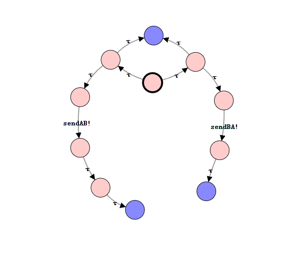
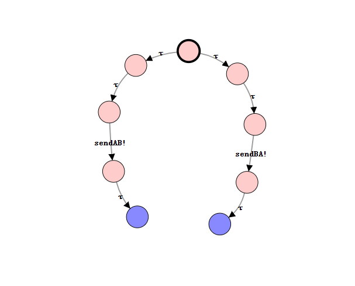
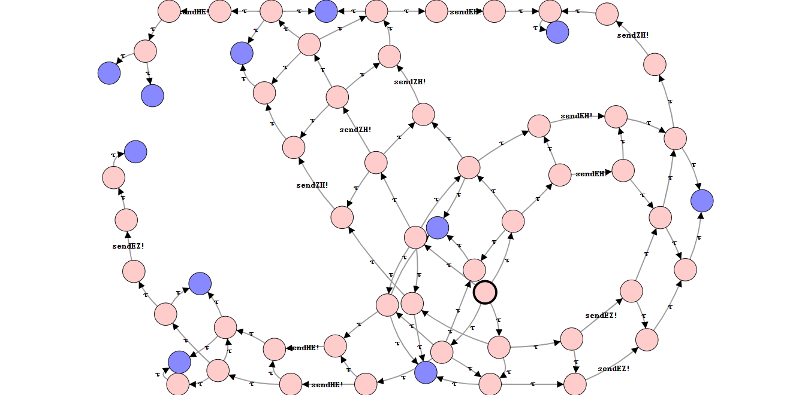
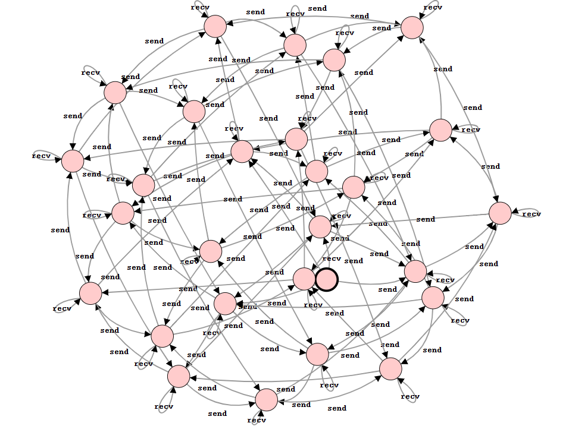
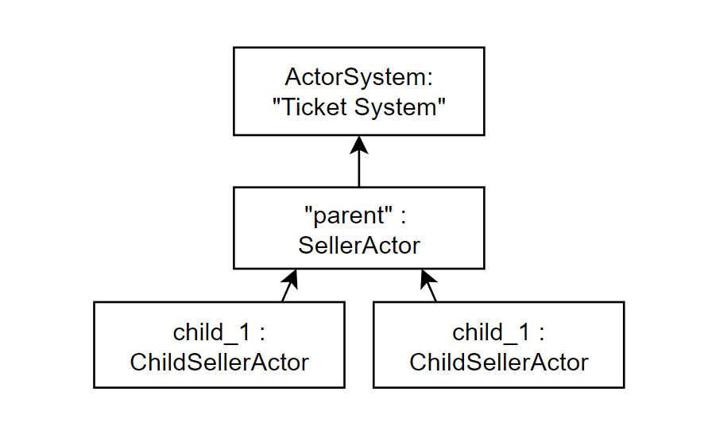
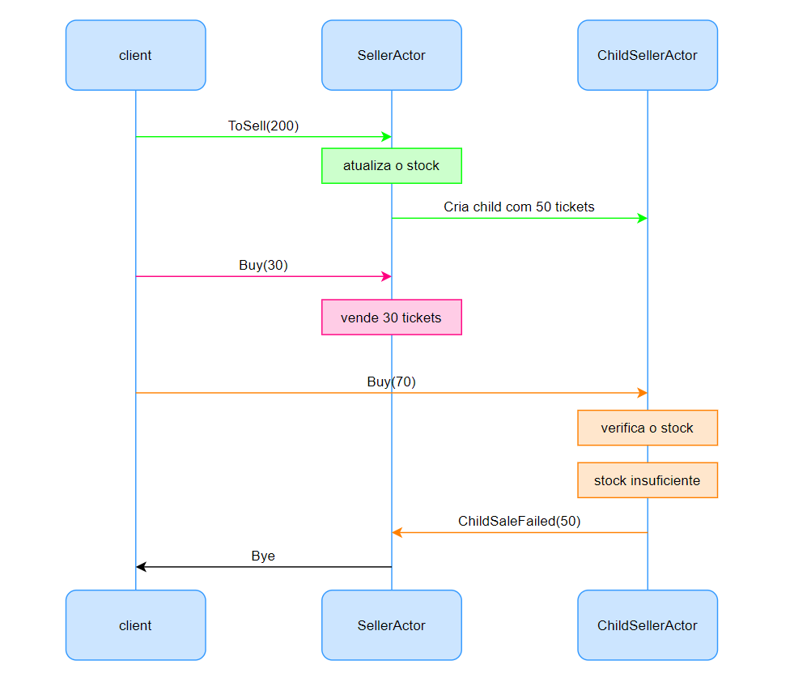

# Exercício 1 — Sending money using locks

## 1.1 Locks with native way

A ideia é representar o sistema como a composição paralela de quatro processos: dois participantes e duas trancas.

```text
PAB := lockA?.lockB?.sendAB!.unlockB?.unlockA!.PAB
PBA := lockB?.lockA?.sendBA!.unlockA?.unlockB!.PBA

LockA := lockA!.unlockA!.LockA
LockB := lockB!.unlockB!.LockB

(PAB | PBA | LockA | LockB) \ {lockA, lockB, unlockA, unlockB}
```



Modelámos dois participantes concorrentes que tentam transferir dinheiro um para o outro. 
Cada transferência exige a aquisição de duas trancas, mas as trancas são adquiridas por ordem inversa nos dois participantes. 
A composição paralela dos dois processos com as duas trancas, seguida de restrição das ações internas, produz um LTS com um estado bloqueado, mostrando o deadlock esperado.

## 1.2 Fixing deadlock

```text
PAB := lockA?.lockB?.sendAB!.unlockB?.unlockA!.PAB
PBA := lockA?.lockB?.sendBA!.unlockB?.unlockA!.PBA

LockA := lockA!.unlockA!.LockA
LockB := lockB!.unlockB!.LockB

(PAB | PBA | LockA | LockB) \ {lockA, lockB, unlockA, unlockB}
```



A correção consiste em impor uma ordem total sobre as trancas. Ambos os processos trancam A e depois o B, o que elimina a possibilidade de espera circular. 
Assim, o sistema corrigido é deadlock-free. Este mesmo não é weakly bisimilar ao sistema inicial, uma vez que o comportamento observável do sistema original inclui a possibilidade de bloqueio terminal.


## 1.3 Using locks in a naive way

```text
Zenitsu := lockZ?.lockH?.sendZH!.unlockH?.unlockZ!.Zenitsu
Hinata  := lockH?.lockE?.sendHE!.unlockE?.unlockH!.Hinata
Eren    := lockE?.lockZ?.sendEZ!.unlockZ?.unlockE!.Eren
        +  lockE?.lockH?.sendEH!.unlockH?.unlockE!.Eren

LockZ := lockZ!.unlockZ!.LockZ
LockH := lockH!.unlockH!.LockH
LockE := lockE!.unlockE!.LockE

(Zenitsu | Hinata | Eren | LockZ | LockH | LockE) \ {lockZ, lockH, lockE, unlockZ, unlockH, unlockE}
```



Neste exercício, modelamos o cenário da Figura 1 com três participantes e três locks, usando uma estratégia deliberadamente naive de aquisição de locks. 
O objetivo não é evitar o problema, mas sim preservar a possibilidade de deadlock. 
O participante Zenitsu só pode enviar para Hinata, enquanto Hinata pode enviar para Eren, e Eren pode enviar para ambos os outros participantes. 
Como cada processo pode adquirir locks numa ordem diferente, o sistema pode entrar em espera circular e bloquear a execução.

Cada participante executa primeiro a aquisição do seu lock e depois tenta adquirir o lock do destinatário antes de realizar o envio. 
Esta escolha cria a situação clássica de deadlock por espera circular, pois um processo pode ficar à espera de um lock que já foi adquirido por outro processo.


## 1.4 Generalização com value passing CCS

```text
P1 := send.P2 + recv.P1
P2 := send.P3 + recv.P2
P3 := send.P1 + recv.P3

System := P1 | P2 | P3
System
```



Este modelo generaliza o cenário anterior usando CCS com passagem de valores. A ideia principal é representar cada participante através do mesmo processo parametrizado P[i], onde o parâmetro i identifica o participante corrente. Assim, em vez de definirmos processos distintos para cada par origem-destino, usamos um único esquema comum para os três participantes, o que preserva a simetria do sistema. A vantagem da passagem de valores é que o destino da comunicação passa a ser um valor, em vez de termos de codificar manualmente cada canal possível.

A ação send?j permite ao participante escolher o identificador j do destinatário. Depois da escolha do destinatário, a ação recv!i representa o envio da identidade do participante atual, permitindo modelar a comunicação de forma abstrata e uniforme. A ação recv?k mantém o processo pronto para receber mensagens de qualquer participante, guardando o valor recebido na variável k.

Como os três participantes são instâncias do mesmo processo parametrizado, eles são equivalentes do ponto de vista estrutural e comportamental. Isto corresponde ao enunciado, que pede three equivalent participants. Além disso, o sistema pode ser facilmente estendido para mais participantes sem alterar a lógica principal: bastaria adicionar novas instâncias P[n] ao paralelismo. Desta forma, o modelo é compacto, simétrico e escalável.

---

# Exercício 2 — Simulação de processos dependentes num servidor

## 2.1 Contador de pedidos thread-safe

Na versão inicial do servidor, o contador de pedidos era atualizado através de uma variável partilhada não sincronizada. Num contexto concorrente, esta abordagem podia originar condições de corrida, uma vez que duas ou mais threads podiam ler o mesmo valor antigo, incrementando localmente e escrever depois o mesmo resultado final, tendo alguma possibilidade de perder atualizações.

Para resolver esta situação, fizemos com que o contador seja substituído por uma estrutura thread-safe baseada em operações atómicas, evitando bloqueios pesados e garante que cada incremento é executado de forma indivisível, mesmo quando vários clientes fazem pedidos ao mesmo tempo.

## 2.2 Thread pool e estrutura partilhada lock-free

Depois da correção do contador, implementamos um thread pool com um número fixo de threads para processar as instruções pendentes. Esta abordagem permite limitar o paralelismo, reutilizar workers já criados e manter pequeno o código executado no momento em que o pedido HTTP é recebido.

Os resultados das instruções `print` passaram a ser guardados numa estrutura partilhada thread-safe, juntamente com uma marca temporal. Assim, o estado do servidor pode ser consultado a qualquer momento através do pedido de `status`, preservando o histórico das execuções concorrentes.

Uma implementação não thread-safe desta estrutura poderia falhar quando várias threads tentassem acrescentar resultados ao mesmo tempo. Nesse caso, algumas mensagens poderiam perder-se, surgir em ordem inconsistente, ou até causar corrupção do estado interno; com a solução adotada, os resultados são registados de forma robusta mesmo com múltiplos pedidos concorrentes.

## 2.3 Dependências entre instruções com `after`

Nesta parte, implementamos um suporte completo à cláusula `after`, permitindo que uma instrução seja executada só depois de todas as instruções dependentes terem terminado. Assim, desta forma, o servidor consegue respeitar relações de precedência sempre que existem várias tarefas concorrentes no sistema.

A interpretação das instruções considera os três componentes definidos: a operação `print`, um atraso opcional com `@`, e uma lista opcional de dependências introduzida por `after`. Assim, o servidor não apenas executa instruções em paralelo, mas também coordena corretamente a ordem de execução sempre que existem restrições entre elas.

## 2.4 Funcionalidade adicional com `volatile`

Acrescentamos também uma funcionalidade didática de ativação e desativação da simulação no servidor. Quando o modo de simulação está desativado, novos pedidos deixam de ser executados e recusa o ato de registo no estado interno do servidor.

Esta funcionalidade foi implementada com uma variável anotada com `@volatile`, pois o seu valor é lido e escrito por múltiplas threads. Sem `volatile`, uma thread poderia continuar a observar um valor antigo e, por isso, aceitar pedidos mesmo depois de outra thread já ter desativado o servidor.

Com `volatile`, garante-se visibilidade imediata da atualização entre threads. Assim, quando o servidor é desativado, os workers passam rapidamente a observar esse novo estado e os pedidos seguintes são recusados de forma consistente.

---

## Exemplo experimental

Para validar o comportamento do servidor em condições reais de utilização, realizamos vários testes manuais através de pedidos HTTP. Estes exemplos permitem observar o funcionamento do contador, o registo dos resultados, a execução concorrente das instruções e as dependências definidas no programa de entrada.  

Nos testes seguintes, confirma-se também que o estado interno do servidor é corretamente atualizado e que as respostas devolvidas correspondem ao comportamento esperado.

#### Exemplo 1 — Execução simples

Foi submetido um único pedido ao servidor com uma instrução simples. No estado observado depois da execução, o contador deverá passar a 1 e a lista de resultados deverá incluir o registo correspondente. Este teste confirma o funcionamento básico do contador thread-safe e do registo de resultados no servidor.

```powershell
PS C:\Users\black> curl.exe "http://localhost:8080/reset"
State reset!
PS C:\Users\black> curl.exe "http://localhost:8080/enable"
Simulation enabled
PS C:\Users\black> curl.exe "http://localhost:8080/run-simulation?cmd=print%20%22a%22"
[1] Request accepted from 127.0.0.1
PS C:\Users\black> Start-Sleep -Seconds 2
PS C:\Users\black> curl.exe "http://localhost:8080/status"

<p><b>counter:</b> 1</p>
<p><b>simulation enabled:</b> true</p>
<ul>
<li>[19:23:09.433] [1] Received request from 127.0.0.1: print "a" (instruction 1)</li>
</ul>
```

#### Exemplo 2 — Vários pedidos concorrentes

Foram enviados vários pedidos quase ao mesmo tempo para o servidor. No estado final, o contador deverá refletir o número total de pedidos aceites e os resultados deverão ficar registados sem perdas. Este teste ilustra que o contador e a estrutura partilhada suportam concorrência de forma correta.

```powershell
PS C:\Users\black> curl.exe "http://localhost:8080/reset"
State reset!
PS C:\Users\black> curl.exe "http://localhost:8080/enable"
Simulation enabled
PS C:\Users\black> 1..5 | ForEach-Object {
>>   $i = $_
>>   Start-Job -ScriptBlock {
>>     param($n)
>>     curl.exe "http://localhost:8080/run-simulation?cmd=print%20%22job$n%22"
>>   } -ArgumentList $i
>> }

Id     Name            PSJobTypeName   State         HasMoreData     Location             Command
--     ----            -------------   -----         -----------     --------             -------
17     Job17           BackgroundJob   Running       True            localhost            ...
19     Job19           BackgroundJob   Running       True            localhost            ...
21     Job21           BackgroundJob   Running       True            localhost            ...
23     Job23           BackgroundJob   Running       True            localhost            ...
25     Job25           BackgroundJob   Running       True            localhost            ...


PS C:\Users\black> Start-Sleep -Seconds 4
PS C:\Users\black> curl.exe "http://localhost:8080/status"

<p><b>counter:</b> 5</p>
<p><b>simulation enabled:</b> true</p>
<ul>
<li>[19:23:59.193] [1] Received request from 127.0.0.1: print "job1" (instruction 1)</li>
<li>[19:23:59.316] [2] Received request from 127.0.0.1: print "job2" (instruction 1)</li>
<li>[19:23:59.441] [3] Received request from 127.0.0.1: print "job3" (instruction 1)</li>
<li>[19:23:59.551] [4] Received request from 127.0.0.1: print "job4" (instruction 1)</li>
<li>[19:23:59.661] [5] Received request from 127.0.0.1: print "job5" (instruction 1)</li>
</ul>
```

#### Exemplo 3 — Pedido com várias instruções independentes

Foi executado um único pedido contendo várias instruções sem dependências entre si. Como não existe cláusula `after`, as instruções podem ser executadas assim que houver threads disponíveis. Este teste mostra que o servidor consegue tratar paralelismo interno dentro do mesmo pedido.

```powershell
PS C:\Users\black> curl.exe "http://localhost:8080/reset"
State reset!
PS C:\Users\black> curl.exe "http://localhost:8080/enable"
Simulation enabled
PS C:\Users\black> curl.exe "http://localhost:8080/run-simulation?cmd=print%20%22A%22%20%40%202%3Bprint%20%22B%22%20%40%201%3Bprint%20%22C%22" # print "A" @ 2; print "B" @ 1; print "C"
[1] Request accepted from 127.0.0.1
PS C:\Users\black> Start-Sleep -Seconds 4
PS C:\Users\black> curl.exe "http://localhost:8080/status"

<p><b>counter:</b> 1</p>
<p><b>simulation enabled:</b> true</p>
<ul>
<li>[19:06:52.301] [1] Received request from 127.0.0.1: print "C" (instruction 3)</li>
<li>[19:06:53.308] [1] Received request from 127.0.0.1: print "B" (instruction 2)</li>
<li>[19:06:54.315] [1] Received request from 127.0.0.1: print "A" (instruction 1)</li>
</ul>
```

#### Exemplo 4 — Dependência linear com `after`

Foi executado um programa em que a segunda instrução depende da primeira. No resultado observado, `B` só deverá ser concluída depois de `A`, respeitando a dependência declarada. Este teste confirma o funcionamento básico da cláusula `after` em dependências lineares.

```powershell
PS C:\Users\black> curl.exe "http://localhost:8080/reset"
State reset!
PS C:\Users\black> curl.exe "http://localhost:8080/enable"
Simulation enabled
PS C:\Users\black> curl.exe "http://localhost:8080/run-simulation?cmd=print%20%22A%22%20%40%202%3Bprint%20%22B%22%20after%201" # print "A" @ 2; print "B" after 1
[1] Request accepted from 127.0.0.1
PS C:\Users\black> Start-Sleep -Seconds 5
PS C:\Users\black> curl.exe "http://localhost:8080/status"

<p><b>counter:</b> 1</p>
<p><b>simulation enabled:</b> true</p>
<ul>
<li>[19:07:57.038] [1] Received request from 127.0.0.1: print "A" (instruction 1)</li>
<li>[19:07:57.038] [1] Received request from 127.0.0.1: print "B" (instruction 2)</li>
</ul>
```

#### Exemplo 5 — Dependência linear com atraso visível

Foi testado um caso em que a segunda instrução depende da primeira e possui também o seu próprio atraso. Assim, o instante de conclusão de `B` deverá surgir claramente depois da conclusão de `A`, o que permite observar de forma mais nítida o efeito combinado de `after` com `@`. Este é um dos testes mais claros para demonstrar que a dependência foi implementada corretamente.

```powershell
PS C:\Users\black> curl.exe "http://localhost:8080/reset"
State reset!
PS C:\Users\black> curl.exe "http://localhost:8080/enable"
Simulation enabled
PS C:\Users\black> curl.exe "http://localhost:8080/run-simulation?cmd=print%20%22A%22%20%40%202%3Bprint%20%22B%22%20%40%203%20after%201" # print "A" @ 2; print "B" @ 3 after 1
[1] Request accepted from 127.0.0.1
PS C:\Users\black> Start-Sleep -Seconds 7
PS C:\Users\black> curl.exe "http://localhost:8080/status"

<p><b>counter:</b> 1</p>
<p><b>simulation enabled:</b> true</p>
<ul>
<li>[19:09:09.199] [1] Received request from 127.0.0.1: print "A" (instruction 1)</li>
<li>[19:09:12.205] [1] Received request from 127.0.0.1: print "B" (instruction 2)</li>
</ul>
```

#### Exemplo 6 — Dependência de junção

Foi considerado um cenário em que uma instrução final depende da conclusão de duas instruções anteriores. Neste caso, `C` só deverá começar depois de `A` e `B` terminarem. O teste ilustra corretamente uma sincronização com múltiplos predecessores.

```powershell
PS C:\Users\black> curl.exe "http://localhost:8080/reset"
State reset!
PS C:\Users\black> curl.exe "http://localhost:8080/enable"
Simulation enabled
PS C:\Users\black> curl.exe "http://localhost:8080/run-simulation?cmd=print%20%22A%22%20%40%202%3Bprint%20%22B%22%20%40%203%3Bprint%20%22C%22%20after%201%2C2" # print "A" @ 2; print "B" @ 3; print "C" after 1,2
[1] Request accepted from 127.0.0.1
PS C:\Users\black> Start-Sleep -Seconds 7
PS C:\Users\black> curl.exe "http://localhost:8080/status"

<p><b>counter:</b> 1</p>
<p><b>simulation enabled:</b> true</p>
<ul>
<li>[19:17:59.239] [1] Received request from 127.0.0.1: print "A" (instruction 1)</li>
<li>[19:18:00.237] [1] Received request from 127.0.0.1: print "B" (instruction 2)</li>
<li>[19:18:00.237] [1] Received request from 127.0.0.1: print "C" (instruction 3)</li>
</ul>
```

#### Exemplo 7 — Desativação da simulação

Foi testada a funcionalidade adicional de desativação da simulação no servidor. Depois de desativado, um novo pedido não deverá ser executado normalmente, e o estado interno deverá refletir essa recusa. Este exemplo serve para ilustrar a utilização de uma variável partilhada com `@volatile`.

```powershell
PS C:\Users\black> curl.exe "http://localhost:8080/reset"
State reset!
PS C:\Users\black> curl.exe "http://localhost:8080/disable"
Simulation disabled
PS C:\Users\black> curl.exe "http://localhost:8080/run-simulation?cmd=print%20%22blocked%22" # print "blocked"
[1] Request accepted from 127.0.0.1
PS C:\Users\black> Start-Sleep -Seconds 2
PS C:\Users\black> curl.exe "http://localhost:8080/status"

<p><b>counter:</b> 1</p>
<p><b>simulation enabled:</b> false</p>
<ul>
<li>[19:20:09.747] [1] Simulation refused for 127.0.0.1: disabled flag</li>
</ul>
```

#### Exemplo 8 — Reativação da simulação

Depois de reativado o servidor, um novo pedido deverá voltar a ser aceite e executado normalmente. Este teste complementa o exemplo anterior e mostra que a flag partilhada é observada corretamente pelas diferentes threads do sistema.

```powershell
PS C:\Users\black> curl.exe "http://localhost:8080/reset"
State reset!
PS C:\Users\black> curl.exe "http://localhost:8080/disable"
Simulation disabled
PS C:\Users\black> curl.exe "http://localhost:8080/enable"
Simulation enabled
PS C:\Users\black> curl.exe "http://localhost:8080/run-simulation?cmd=print%20%22ok-again%22" # print "ok-again"
[1] Request accepted from 127.0.0.1
PS C:\Users\black> Start-Sleep -Seconds 2
PS C:\Users\black> curl.exe "http://localhost:8080/status"

<p><b>counter:</b> 1</p>
<p><b>simulation enabled:</b> true</p>
<ul>
<li>[19:20:52.218] [1] Received request from 127.0.0.1: print "ok-again" (instruction 1)</li>
</ul>
```

---

# Exercise 3

## 3.1 Ticket office with Actors

A ideia é completar o template fornecido e implementar um ator de bilheteira. Este ator deve poder receber mensagens `ToSell(n)` para aumentar o número de bilhetes disponíveis e mensagens `Buy(n)` para vender bilhetes. Se o pedido for maior do que o stock disponível, a compra deve falhar e deve ser registada uma mensagem de erro.

```scala
import akka.actor.{Actor, ActorSystem, Props}
import akka.event.Logging

object TicketOfficeTest extends App {
    case class ToSell(n:Int)
    case class Buy(n: Int)
    case object Bye

    class SellerActor extends Actor {
        val log = Logging(context.system, this)
        var stock: Int = 0

        def receive: Actor.Receive = {
            case ToSell(n) =>
                stock += n
                log.info(s"Added $n tickets. Stock is now $stock.")

            case Buy(n) =>
                if (n <= stock) {
                    stock-= n
                    log.info(s"Sold $n tickets. Stocks is now $stock.")
                } else {
                    log.error(s"Purchase failed: request $n, avaliable $stock.")
                }

            case "Bye" =>
                log.info(s"Closing ticket office. Final stock = $stock.")
                context.stop(self)
        }
    }

    val sys = ActorSystem("TicketSys")
    val ticketOffice = sys.actorOf(Props[SellerActor], "mainoffice")

    ticketOffice ! ToSell(2000)
    for (_ <- 0 until 101) ticketOffice ! Buy(20)
    println("Tried to buy many 2020 tickets.")
    ticketOffice ! "Bye"

    Thread.sleep(3000)
    sys.terminate()
}
```

Neste excerto de código, foi implementado um `SellerActor` que mantém o stock interno de bilhetes. Quando recebe `ToSell(n)`, aumenta o stock; quando recebe `Buy(n)`, verifica se existem bilhetes suficientes. Se existirem, reduz o stock; caso contrário, regista uma mensagem de erro e mantém o estado inalterado.

Esta solução segue o modelo de atores porque o stock pertence a um único ator e só é modificado através de mensagens. Assim, evita-se partilha direta de memória e não é necessário usar sincronização explícita.


## 3.2 Tickets office  with a delegation funtionality

### Código Scala

```scala
import akka.actor.{Actor, ActorRef, ActorSystem, Props}
import akka.event.Logging

object TicketOfficeDelegationTest extends App {

    case class ToSell(n: Int)
    case class Buy(n: Int)
    case class ChildSaleFailed(remaining: Int)
    case object "Bye"


    class ChildSellerActor(parent: ActorRef, var stock: Int) extends Actor {
        val log = Logging(context.system, this)

        def receive: Actor.Receive = {
            case Buy(n) =>
                if (n <= stock) {
                    stock -= n
                    log.info(s"[Child] Sold $n tickets. Remaining: $stock.")
                } else {
                    log.error(s"[Child] Purchase failed: requested $n, available $stock.")
                    parent ! ChildSaleFailed(stock)
                    context.stop(self)
                }

        case "Bye" =>
            log.info(s"[Child] Closing. Returning $stock tickets to parent.")
            parent ! ChildSaleFailed(stock)
            context.stop(self)
        }
    }

    class SellerActor extends Actor {
        val log = Logging(context.system, this)
        var stock: Int = 0
        val threshold = 100
        val childChunk = 50

        def receive: Actor.Receive = {
            case ToSell(n) =>
                stock += n
                log.info(s"Added $n tickets. Stock is now $stock.")
                if (stock > threshold) {
                    val childStock = math.min(childChunk, stock)
                    stock -= childStock
                    val child = context.actorOf(Props(new ChildSellerActor(self, childStock)))
                    log.info(s"Created child ${child.path.name} with $childStock tickets. Parent stock: $stock.")
            }

            case Buy(n) =>
                if (n <= stock) {
                    stock -= n
                    log.info(s"Sold $n tickets. Stock is now $stock.")
                } else {
                    log.error(s"Purchase failed at parent: requested $n, available $stock.")
                }

            case ChildSaleFailed(remaining) =>
                stock += remaining
                log.info(s"Child returned $remaining tickets. Stock is now $stock.")

            case "Bye" =>
                log.info(s"Closing ticket office. Final stock = $stock.")
                context.stop(self)
        }
    }

    val sys = ActorSystem("TicketSys")
    val ticketOffice = sys.actorOf(Props[SellerActor], "mainoffice")

    ticketOffice ! ToSell(200)
    ticketOffice ! Buy(30)
    ticketOffice ! Buy(70)
    ticketOffice ! "Bye"

    Thread.sleep(3000)
    sys.terminate()
}
```

Aqui temos um sistema de bilheteira com atores em Akka. O ator principal (SellerActor) mantém o stock de bilhetes e responde às mensagens de `ToSell(n)` e `Buy(n)`. Quando ele recebe `ToSell(n)`, atualiza o seu stock interno. Se a mensagem recebida for `Buy(n)`, este tenta vender os  tickets, aceitando o pedido se existir quantidade suficiente .  

Para além do ator principal, foi criamos o `ChildSellerActor`, para suportar a funcionalidade de delegação. Quando o stock do ator principal ultrapassa um determinado quantidade, este cria um filho e transfere uma parte fixa de *tickets*. Desta forma, o sistema passa a ter uma estrutura hierárquica, com um ator pai responsável pela gestão global e (um ou mais) filhos responsáveis por parte do trabalho.  

O `ChildSellerActor` recebe também pedidos de compra sempre que consegue satisfazer o pedido e reduz o seu stock. Caso contrário, este envia uma mensagem `ChildSaleFailed(remaining)` ao pai, devolvendo a quantidade de *tickets* que ainda lhe restava. Esta tal mensagem permite ao ator principal recuperar o stock e manter o estado consistente do sistema.  

A implementação foi testada com uma sequência de mensagens que inclui a criação de stock, algumas compras e o encerramento do sistema com Bye. Este teste permite observar o comportamento de uma venda e/ou o comportamento de uma falha e devolução de stock, por parte do ator filho.  

### Actor Hierarchy



O diagrama da hierarquia de atores mostra a organização estrutural do sistema em tempo de execução. No topo encontra-se o *ActorSystem*, que contém o ator principal *SellerActor*. Sempre que o stock disponível ultrapassa o limiar definido, este ator cria um novo *ChildSellerActor*, que fica subordinado ao pai na hierarquia.  

Esta estrutura é importante porque reflete o modelo de criação e a posse de atores no Akka. Um ator criado com `context.actorOf` torna-se filho do ator que o criou, o que significa que a sua existência está associada ao pai. Assim desta forma, o diagrama evidencia a relação entre o ator principal e os seus filhos, tal como foi discutido nas aulas teóricas sobre hierarquia e lifecycle de atores.  

### Sequence diagram



O diagrama de sequência descreve uma execução possível do sistema e mostra a ordem em que as mensagens são trocadas. 

O primeiro ato mostra o processo da criação de um filho *(destacado em verde)*, enviando o `ToSell(200)`, que chega ao SellerActor. Este atualiza o seu stock interno e, como o stock ultrapassa o limiar definido, cria um ChildSellerActor com 50 *tickets*.

No ato seguinte representa uma venda normal, sem criação de filho *(destacado a cor-de-rosa)*, o cliente envia `Buy(30)`, que é tratado pelo SellerActor, e reduz o stock disponível. 

De seguida, com criação de filho *(destacado a cor-de-laranja)*. É enviado `Buy(70)` para o *ChildSellerActor*, verifica o seu stock local e, por sua vez, é detetado *tickets* suficientes para satisfazer o pedido.
Perante essa situação, o *ChildSellerActor* executa a sua verificação interna e envia ao ator pai a mensagem `ChildSaleFailed(50)`, indicando que tem 50 *tickets*. O *SellerActor* recebe essa mensagem e reintegra esse stock no seu estado interno. 

Por fim, o ato Bye *(destacado a cor preta)*, o cliente envia Bye, e termina a execução do sistema.

Este diagrama de sequência é útil porque mostra claramente a delegação entre atores e a forma como a falha de venda é tratada.

Neste sistema, o filho comunica o resultado ao pai, que recupera o stock remanescente, daí a comunicação por mensagens e não por memória partilhada.